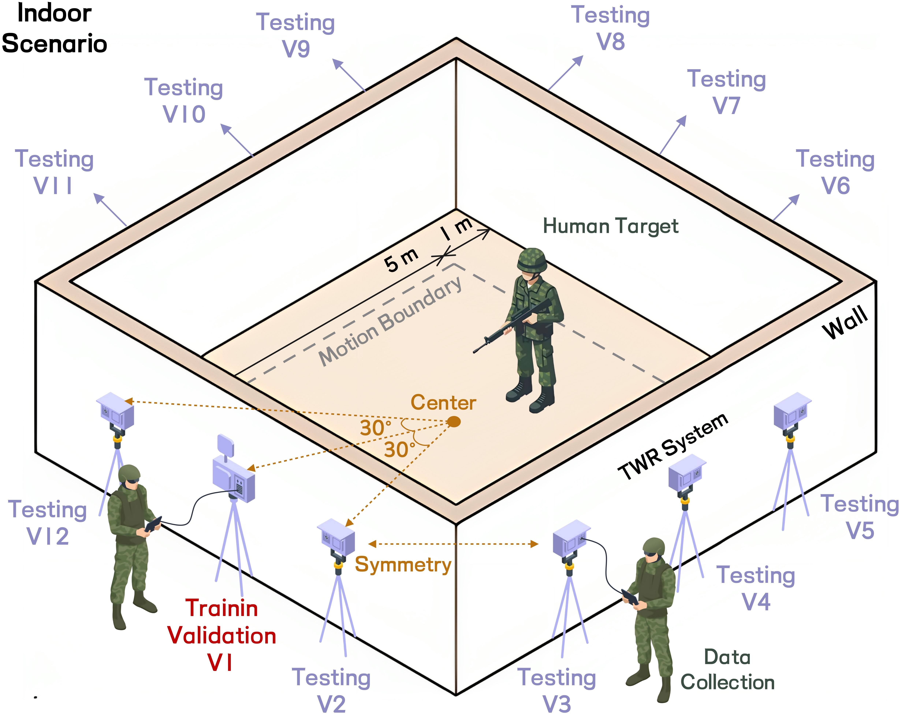

<div align="center">



<h1 style="color:#000000;">Omnidirectional TWR HAR</h1>

<p>
  <b>Micro-Doppler Optical Flow Feature for Omnidirectional Through-the-Wall Radar Human Activity Recognition</b>
</p>

<kbd>
  <a href="https://www.semanticscholar.org/author/Weicheng-Gao/2051685234">
    
  </a>
</kbd>
&nbsp;&nbsp;
<kbd>
  <a href="https://joeybgofficial.github.io/">
    
  </a>
</kbd>
&nbsp;&nbsp;
<kbd>
  <a href="https://ieeexplore.ieee.org/author/37089574449">
    
  </a>
</kbd>
&nbsp;&nbsp;
<kbd>
  <a href="https://radar.bit.edu.cn/index.htm">
    
  </a>
</kbd>

</div>

---

## 💡 I. Introduction & Overview

**This repository provides a MATLAB implementation of omnidirectional through-the-wall radar human activity recognition based on micro-Doppler optical flow (mDOF) feature.**

Through-the-wall radar (TWR) human activity recognition (HAR) is strongly affected by observation orientation. A classifier trained at one radar view often suffers from severe performance degradation when the same activity is observed from another view. To improve cross-orientation generalization, this work extracts the horizontal component of the micro-Doppler optical flow from Doppler-time maps (DTMs), which can suppress the dominant orientation-induced feature variation while preserving human motion dynamics.

### 📄 Paper Information

* **Title:** Orientation-Invariant Micro-Doppler Signature Representation in Through-the-Wall Radar Human Activity Recognition.
* **Journal Reference:** Submitted to IEEE Transactions on Signal Processing (IEEE TSP), under review.

**😊 If you find that the proposed method does not work well on your own dataset, the following two alternative approaches may yield optimistic results. These are all the fruits of our exploration during the research process. With the help of AI tools, we successfully organize them into projects that can be run with one click:**

| Omnidirectional TWR HAR (Small Transfer Version) | Omnidirectional TWR HAR (Multi-Domain Version) |
| :---: | :---: |
|  |  | 
| https://github.com/JoeyBGOfficial/Omnidirectional-Through-the-Wall-Radar-Human-Activity-Recognition-Small-Transfer-Version | https://github.com/JoeyBGOfficial/Omnidirectional-Through-the-Wall-Radar-Human-Activity-Recognition-Multi-Domain-Version |

---

## ✨ II. Core Highlights

<table>
  <tr align="center">
    <td width="50%">
      <h3>🧠 1. Orientation-Invariant Theory</h3>
      <p>An augmented human kinematic model is coupled with optical flow on DTMs, proving that the horizontal mDOF component cancels the dominant first-order orientation factor.</p>
      <br>
    </td>
    <td width="50%">
      <h3>🌊 2. Unsupervised mDOF Extraction</h3>
      <p>A functional-analysis-inspired optical-flow pipeline extracts large-scale micro-Doppler motion fields from DTMs without requiring orientation labels or supervised feature annotations.</p>
      <br>
    </td>
  </tr>
  <tr align="center">
    <td>
      <h3>🧩 3. Manifold-Based Feature Reduction</h3>
      <p>Local linear smoothing and compact mDOF reduction suppress outliers and noise, lower feature dimension, and preserve temporal activity dynamics with stronger cross-view consistency.</p>
      <br>
    </td>
    <td>
      <h3>🚀 4. Single-Orientation Generalization</h3>
      <p>The recognition framework is trained only on the main 0-degree view and directly evaluated on 30-330-degree simulated and measured testing views to verify omnidirectional HAR ability.</p>
      <br>
    </td>
  </tr>
</table>

---

## 🛠️ III. How to Install

This repository is fully developed in MATLAB. No Python, CUDA, or extra external codebase is required.

### 🔧 Part 1: Prepare MATLAB Environment

Suggested environment:

> (1) MATLAB R2025b or later.<br>
> (2) Image Processing Toolbox.<br>
> (3) Deep Learning Toolbox.<br>
> (4) Parallel Computing Toolbox is optional and can be used for acceleration when available.

Download or clone the whole repository, then open MATLAB and enter the repository root folder:

```matlab
cd("Your_Path/Omnidirectional-Through-the-Wall-Radar-Human-Activity-Recognition-main");
```

### 🗂️ Part 2: Prepare Dataset Folders

The repository supports both the simulated dataset and measured real-world dataset. Please put them directly under the repository root folder with the following exact names:

```text
Omnidirectional_TWR_HAR_mDOF_Open_Source/
|-- Multi-View_RWSet/
|-- Multi-View_SimHSet/
|-- Functions/
|-- Visualization/
|-- Main_Train_Omnidirectional_TWR_HAR_mDOF.m
|-- Main_Infer_New_DTM.m
```

The measured dataset should be named `Multi-View_RWSet` and organized as:

```text
Multi-View_RWSet/
|-- Multi-View_RW_Training_and_Validation_Set/
|   |-- Bodyrotating/
|   |-- Empty/
|   |-- Falling to Walking/
|   |-- Grabbing/
|   |-- Kicking/
|   |-- Punching/
|   |-- Sitting Down/
|   |-- Sitting to Walking/
|   |-- Standing Up/
|   |-- Walking/
|   |-- Walking to Falling/
|   |-- Walking to Sitting/
|
|-- Multi-View_RW_Testing_Set/
|   |-- 30/
|   |-- 60/
|   |-- 90/
|   |-- 120/
|   |-- 150/
|   |-- 180/
|   |-- 210/
|   |-- 240/
|   |-- 270/
|   |-- 300/
|   |-- 330/
```

Each activity folder under `Multi-View_RW_Training_and_Validation_Set` should contain 0-degree DTM images named like:

```text
1.png, 2.png, ..., 300.png
```

Each angle folder under `Multi-View_RW_Testing_Set` should contain the same 12 activity folders, and each activity folder should contain testing DTM images named like:

```text
1.png, 2.png, ..., 30.png
```

The simulated dataset should be named `Multi-View_SimHSet` and organized in the same way:

```text
Multi-View_SimHSet/
|-- Multi-View_SimH_Training_and_Validation_Set/
|-- Multi-View_SimH_Testing_Set/
```

### 🏋️ Part 3: Run One-Key Training

Run the following script in MATLAB:

```matlab
run("Main_Train_Omnidirectional_TWR_HAR_mDOF.m");
```

The default dataset is `Multi-View_RWSet`. To use `Multi-View_SimHSet`, open `Main_Train_Omnidirectional_TWR_HAR_mDOF.m` and set:

```matlab
Config.Dataset_Name = "SimHSet";
```

The script automatically generates:

```text
Generated_Features/
Trained_Models/
Training_Results/
```

### 🔍 Part 4: Run New DTM Inference

After training, set the input DTM path and model package path in `Main_Infer_New_DTM.m`:

```matlab
Input_DTM_Path = "Your_DTM_Image.png";
Model_Package_Path = "Trained_Models/JoeyBG_mDOF_RWSet_Model.mat";
```

Then run:

```matlab
run("Main_Infer_New_DTM.m");
```

## ⚠️ V. Important Notes

**📊 1. Dataset Usage** <br>
The training and validation subset contains only 0-degree DTM images. The script splits this subset into training and validation sets with an 8:2 class-balanced ratio. The testing subset contains 30-330-degree views and is used only for cross-orientation evaluation.

**💾 2. Feature Cache** <br>
The first full run may take a long time because every DTM image needs to be converted into mDOF features. The extracted features are stored in `Generated_Features/` and reused automatically in later runs. To recompute them, set:

```matlab
Config.Feature.Force_Recompute_Features = true;
```

**📈 3. Accuracy Tuning** <br>
The default feature extraction size balances speed and accuracy. For high-accuracy full experiments, increasing the following parameter is recommended:

```matlab
Config.Feature.Flow_Estimation_Size = 384;  % or 512
```

Please tune parameters only according to the 0-degree validation set, and do not use testing views for model training.

**🔐 4. Copyright & Usage Rights** <br>
This repository is released for learning and academic research purposes. Any direct use for paper submissions, patents, or commercialization should receive explicit consent from the author or research team.

<div align="center">
  <p><i>⭐ If you find this repository helpful, please consider citing our related papers and giving this repository a star. Really appreciated! ⭐</i></p>
</div>
